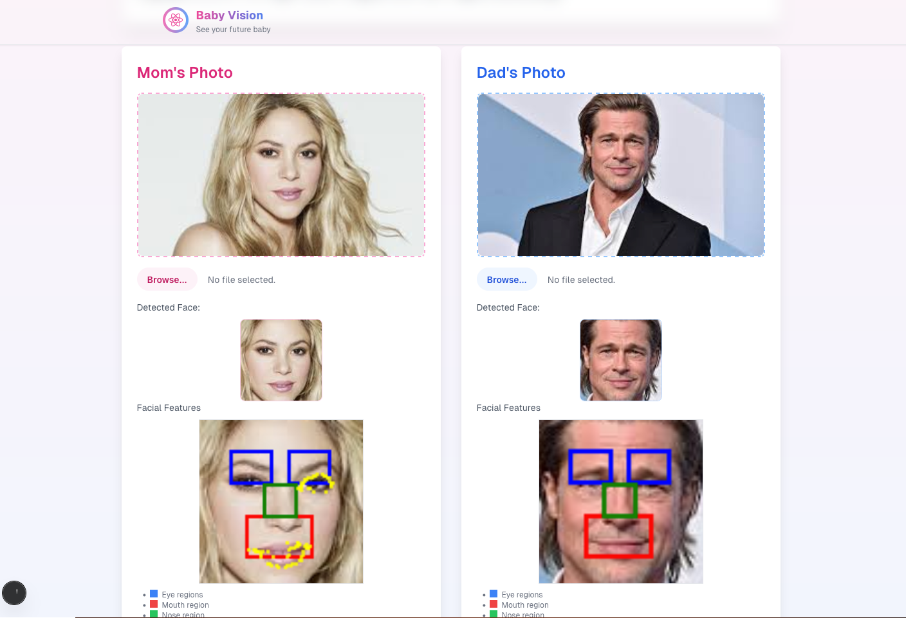

# Baby Vision Generator

<div align="center">
  
</div>

Baby Vision Generator is a web application that allows users to upload photos of both parents and visualize what their baby might look like. This is the frontend portion of the application which handles face detection using OpenCV and extracts facial features for processing.

## Demo

Try the live demo at: [https://baby-vision.vercel.app/](https://baby-vision.vercel.app/)

## Features

- Upload photos of both parents
- Face detection with OpenCV
- Extraction of facial features for further processing
- Basic image processing and visualization

### Installation

1. Clone the repository:

   ```
   git clone https://github.com/shdezhahanj/BabyVision.git
   cd BabyVision
   ```

2. Install dependencies:

   ```
   npm install
   ```

3. Start the development server:

   ```
   npm run dev
   ```

4. Open your browser and navigate to `http://localhost:3000`.

## How It Works

1. **Parent Photo Upload**: Users upload clear photos of both parents.
2. **Face Detection**: The application uses OpenCV to detect faces in the uploaded images.
3. **Feature Extraction**: Facial features are extracted from the detected faces.
4. **Data Preparation**: The extracted features are prepared in a format suitable for backend processing.

## Technologies Used

- Next.js
- Tailwind CSS (styling)
- OpenCV (face detection and feature extraction)

## Limitations

- For optimal results, upload clear, front-facing photos of both parents.
- Face detection works best with good lighting and minimal obstructions.
- If no face is detected or multiple faces are found in an image, the system will default to using the center of the image.
- This is only the frontend portion - actual baby image generation requires integration with a backend service.

## Future Development

- Integration with backend services for advanced image processing
- Improved face detection algorithms
- Enhanced feature extraction capabilities
- Support for more diverse facial features

## License

[MIT License](LICENSE)
